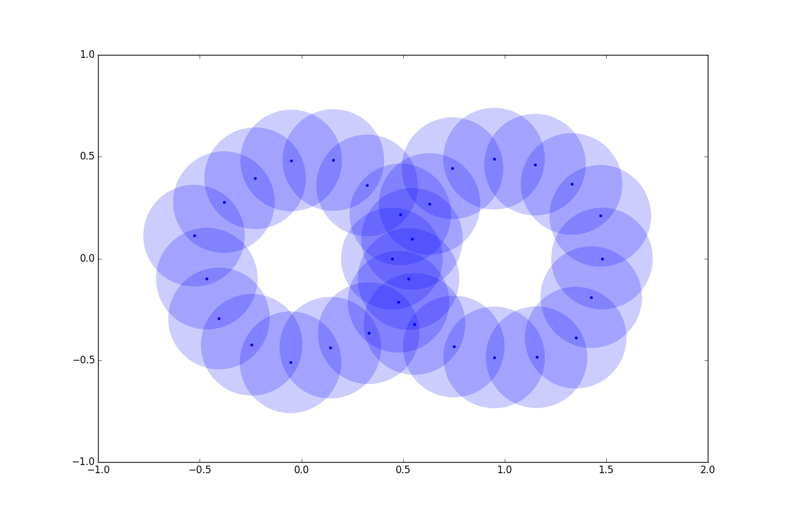
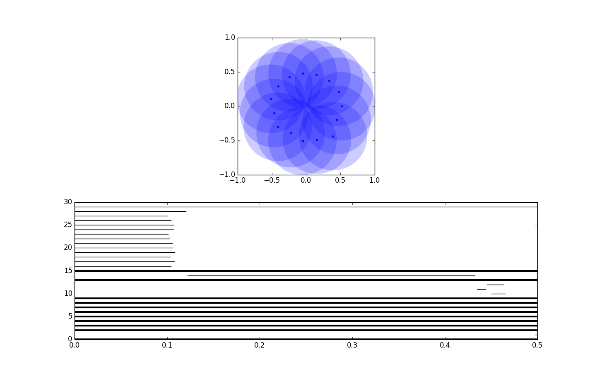

# Persistent Homology

This repository contains Julia implementations of two fundamental algorithms for topological data analysis, along with some examples of usage. A good introduction to basic the basic concepts of topological data analysis and persistent homology can be found in [1]. The implementation is extremely light-weight and has no external dependencies.

### Reduction algorithm

Given a set of points `P` in a finite-dimensional real space, and a real number `x`, this algorithm calculates the homology of the space generated by the union of open balls of radius x around each point. This is done by constructing the Vietoris-Rips complex that `P` and `x` generate. The Vietoris-Rips complex is a simplicial complex and its homology is determined by the ranks of the matrices that represent the boundary mappings.

We do not explicitly compute the homology groups, but return only their ranks, which are called the *Betti numbers* of the space. The justification of this approach is discussed in [2], and is fundamentally due do Borsuk's Nerve Theorem. For a rigorous introduction to the methods of algebraic topology, we refer to [3].

In the following example we estimate the homology of a space generated by quasi-randomly distributed points along two tangent circles.

```
julia Examples/SimpleHomologyExample.jl
> Complex construction
> elapsed time: 0.390368682 seconds
> 0-dim: 30 simplices
> 1-dim: 79 simplices
> 2-dim: 71 simplices
> 3-dim: 30 simplices
> 4-dim: 7 simplices
> Computing homology
> elapsed time: 0.447325902 seconds
> Betti number 0 is 1.
> Betti number 1 is 2.
> Betti number 2 is 0.
> Betti number 3 is 0.
> Betti number 4 is 0.
```

The image shows the points and discs. For each `n` pairwise intersecting circles, there is an `n` simplex.

### Persistent Homology

This algorithm is due to Carlsson/Zomorodian (see [4]) and can be thought of as an evaluation of the reduction algorithm over multiple values of `x` at the same time. The result is a list of 'lifespans' of various topological properties of the space in question, often called a *barcode* (see example below). This approach is called *persistence* and as Carlsson and Zomorodian prove, it can be calculated in the same time as regular homology.

In the following example we estimate the persistent homology of a space generated by quasi-randomly distributed along a circle.

```
julia Examples/PersistentHomologyExample.jl
> VR-Complex.
> Complex construction
> elapsed time: 0.494225547 seconds
> 0-dim: 15 simplices
> 1-dim: 97 simplices
> 2-dim: 361 simplices
> 3-dim: 868 simplices
> 4-dim: 1429 simplices
> 5-dim: 1659 simplices
> 6-dim: 1373 simplices
> 7-dim: 806 simplices
> 8-dim: 328 simplices
> 9-dim: 88 simplices
> 10-dim: 14 simplices
> elapsed time: 0.603990127 seconds
> Filtration.
> elapsed time: 0.851140247 seconds
> Sorting by degree.
> elapsed time: 0.508526118 seconds
> Dimension 0: 14 intervals
> Dimension 1: 82 intervals
> Dimension 2: 69 intervals
> Dimension 3: 52 intervals
> Dimension 4: 37 intervals
> Dimension 5: 22 intervals
> Dimension 6: 13 intervals
> Dimension 7: 8 intervals
> Dimension 8: 6 intervals
> Dimension 9: 3 intervals
> Dimension 10: 1 intervals
```


The image shows the space that generates the maximum density complex, and the barcode below shows the evolution of the homology over 10000 values of `x`, from `0` to `0.5`. Different dimensions are separated by the thick lines. As expected, the most *persisting* properties are a single path component, with a single hole in the middle.

### Usage
We refer to the Examples for demonstration of usage, which is fairly straightforward.

### Caveat
Constructing simplicial complexes is a notoriously slow operation and time complexity can easily grow exponentially in the number of points. This implementation is no exception. With fully connected simplices of dimension no more than 15-20 there is already a significant slow-down.

### On the backlog
* Implementation of persistent homology algorithm over arbitrary fields.
* Various optimizations and refactoring, including the structure of the Vietoris-Rips complex.
* User interface.
* Ability to construct complexes over arbitrary metrics.
* More implementations!

Feel free to make pull requests for any small thing!

[1] http://www.ams.org/journals/bull/2009-46-02/S0273-0979-09-01249-X/S0273-0979-09-01249-X.pdf

[2] http://citeseerx.ist.psu.edu/viewdoc/download?doi=10.1.1.92.9719&rep=rep1&type=pdf

[3] https://www.math.cornell.edu/~hatcher/AT/AT.pdf

[4] http://citeseerx.ist.psu.edu/viewdoc/download?doi=10.1.1.116.2471&rep=rep1&type=pdf
